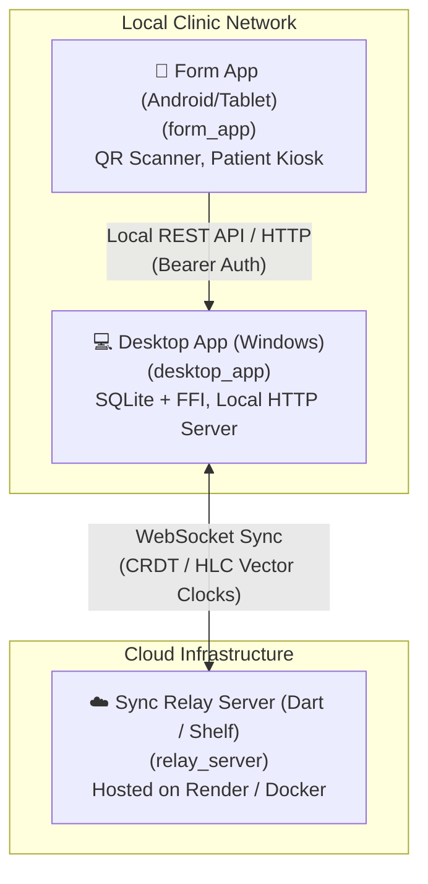

#  ISKOLINIC

<!--  -->


> **School Health & Clinic Management System**  
> An offline-first, multi-platform clinic management solution featuring CRDT multi-device sync, local tablet pairing, health record management, and inventory tracking.

---

## 📐 System Architecture

IskoLinic consists of three decoupled components working together over local networks and cloud relay servers:



---

## 📦 Sub-Projects Overview

| Project | Description | Platform | Tech Stack |
| :--- | :--- | :--- | :--- |
| [**`desktop_app`**](./desktop_app/README.md) | Central clinic administration workstation | Windows Desktop | Flutter Desktop, SQLite FFI, Provider, Shelf Server |
| [**`form_app`**](./form_app/README.md) | Kiosk & tablet patient check-in app | Android / Tablet | Flutter Mobile, Mobile Scanner, HTTP, Video Player |
| [**`relay_server`**](./relay_server/README.md) | Multi-device background cloud sync relay | Cloud Server | Dart, Shelf, WebSockets, Docker |

---

## ✨ Key Features

- 🔄 **Offline-First CRDT Sync**: Real-time bidirectional data synchronization between desktop workstations and cloud relay servers using Hybrid Logical Clocks (HLC).
- 📶 **Local QR Pairing**: Pair tablet kiosks to desktop workstations via QR code scanning for zero-cloud local patient check-ins.
- 📋 **Comprehensive Patient & Visit Records**: Manage demographics, medical histories, vaccination status, and visitation logs.
- 💊 **FEFO Inventory Management**: Track medical supplies with First-Expired, First-Out automatic deductions upon visit recording.
- 📊 **Clinic Analytics**: Visual frequency charts for student symptoms, treatment patterns, and supply consumption.

---

## 🛠️ Step-by-Step Build & Deployment Summaries

### 💻 1. Building Windows Desktop Application (`desktop_app`)

```powershell
# Navigate to desktop app directory
cd desktop_app

# Get dependencies
flutter pub get

# Build Windows Release executable
flutter build windows --release
```

*For creating installer setup files via Inno Setup, see the detailed [desktop_app Build Guide](./desktop_app/README.md#-build--deployment-guide).*

---

### 📱 2. Building Android Tablet Form App (`form_app`)

```powershell
# Navigate to form app directory
cd form_app

# Get dependencies
flutter pub get

# Build Release APK using the automated build script
.\build_apk.ps1
```

*The packaged APK will be saved in `form_app/dist/IskoLinic-Form-App-<version>.apk`. For details, see the [form_app Build Guide](./form_app/README.md#-build--deployment-guide).*

---

### ☁️ 3. Deploying Relay Server (`relay_server`)

```bash
# Navigate to relay server directory
cd relay_server

# Build & run locally with Docker
docker build -t iskolinic-relay-server .
docker run -p 8080:8080 iskolinic-relay-server
```

*For deploying to Render web services, see the detailed [relay_server Deployment Guide](./relay_server/README.md#-deployment-guide-render).*

---

## 📜 License & Copyright

Developed by the **IskoLinic Team**.  
Copyright © 2026 Rovic Xavier Aliman. All rights reserved.
