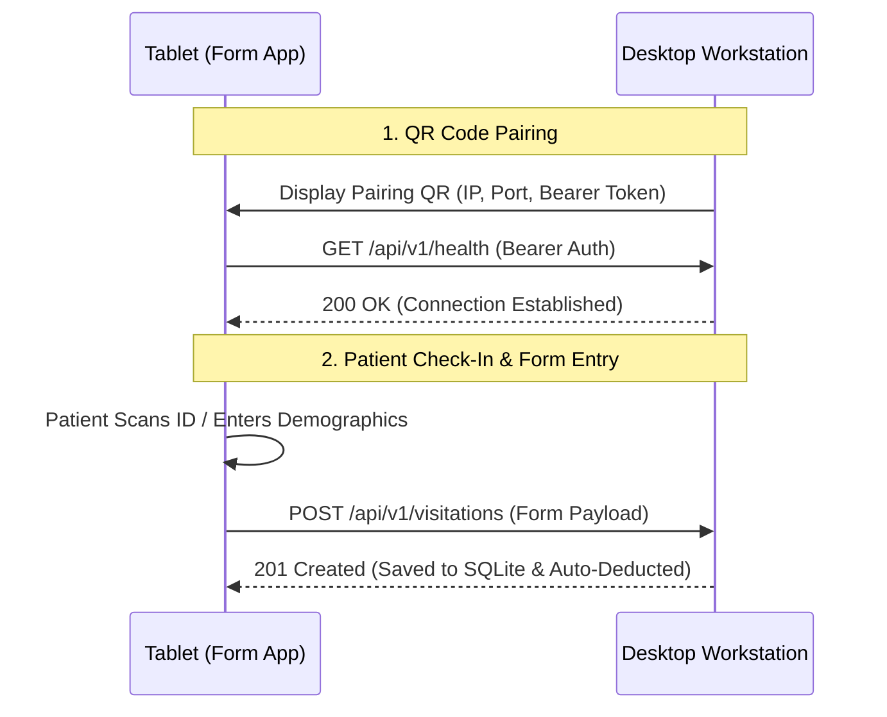

# IskoLinic — Form App (Tablet / Kiosk App)

A **Flutter mobile/tablet application** used by patients and clinic visitors for self-registration, identification, and visit form entry. Works in tandem with the [**`desktop_app`**](../desktop_app/README.md) over a secure local Wi-Fi / LAN network.

**Package name:** `iskolinic_form_app`  
**Target platform:** Android Tablets & Kiosks  
**Application ID:** `com.iskolinic.form_app`  

---

## 📱 System Overview & Flow



---

## 🖥️ Screen Navigation Flow

1. **`ConnectionHelpScreen` (`screens/connection_help_screen.dart`)**: Initial guidance screen explaining how to pair the tablet to the Desktop workstation.
2. **`QrScanScreen` (`screens/qr_scan_screen.dart`)**: Uses `mobile_scanner` to scan the pairing QR code displayed on the desktop's `ConnectionScreen`.
3. **`ConnectionLoadingScreen` (`screens/connection_loading_screen.dart`)**: Authenticates with the desktop server via HTTP `Bearer` token and stores local connection credentials.
4. **`WelcomeScreen` (`screens/welcome_screen.dart`)**: Kiosk standby screen featuring background video playback, dynamic logo branding, and student interaction prompts.
5. **`IdentificationMethodScreen` (`screens/id_method_screen.dart`)**: Allows visitors to choose check-in method: QR / Barcode Scan vs. Manual Name/ID search.
6. **`BarcodeScannerScreen` (`screens/barcode_scanner_screen.dart`)**: Scans student ID cards or QR badges.
7. **`InputFormScreen` (`screens/input_form_screen.dart`)**: Symptom selection chips (Medical, Traumatic, Behavioral), chief complaint, and initial details entry.
8. **`ConfirmationScreen` (`screens/confirmation_screen.dart`)**: Thank-you acknowledgment screen that auto-resets back to the `WelcomeScreen`.

---

## 🔑 Key Features & Security

- 🔒 **Bearer Token Authentication**: Each tablet pairs using an encrypted token generated by the desktop workstation.
- 📶 **Zero-Cloud Local Operation**: Runs completely offline within the clinic's local Wi-Fi / Ethernet subnet.
- 📺 **Dynamic Video & Branding**: Downloads dynamic welcome videos and customized school logos directly from the paired desktop server.
- 🏷️ **Hardware Camera Barcode Scanner**: Uses `mobile_scanner` for rapid student ID lookup.

---

## 🛠 Build & Deployment Guide

### Prerequisites

- [Flutter SDK](https://storage.googleapis.com/flutter_infra_release/releases/stable/windows/flutter_windows_3.29.0-stable.zip) (^3.29.0 or compatible Dart SDK ^3.9.2)
- Android SDK with API Level 34+ build tools
- Android device or tablet in Developer Mode (USB Debugging enabled)

---

### 1. Automated Build Script (Recommended)

Run the included PowerShell script to extract version info from `pubspec.yaml`, compile the release APK, and output the binary into the `dist/` directory:

```powershell
# Run from form_app directory
.\build_apk.ps1
```

**Output binary:**  
`dist/IskoLinic-Form-App-1.2.0.apk`

---

### 2. Manual Flutter APK Build

```powershell
# Fetch dependencies
flutter pub get

# Build Release APK
flutter build apk --release
```

**Compiled output location:**  
`build/app/outputs/flutter-apk/app-release.apk`

---

### 3. Installing APK onto Android Tablet

Connect your Android tablet via USB or Wi-Fi ADB and run:

```powershell
adb install dist/IskoLinic-Form-App-1.2.0.apk
```

---

## 📜 Dependencies

| Package | Version | Purpose |
| :--- | :--- | :--- |
| `mobile_scanner` | ^6.0.2 | Camera barcode & QR code scanning |
| `video_player` | ^2.8.2 | Standby kiosk video loop playback |
| `http` | ^1.3.0 | REST API client for Desktop pairing & form submit |
| `google_fonts` | ^6.2.1 | Typography |
| `shared_preferences` | ^2.5.5 | Storing server connection credentials |
